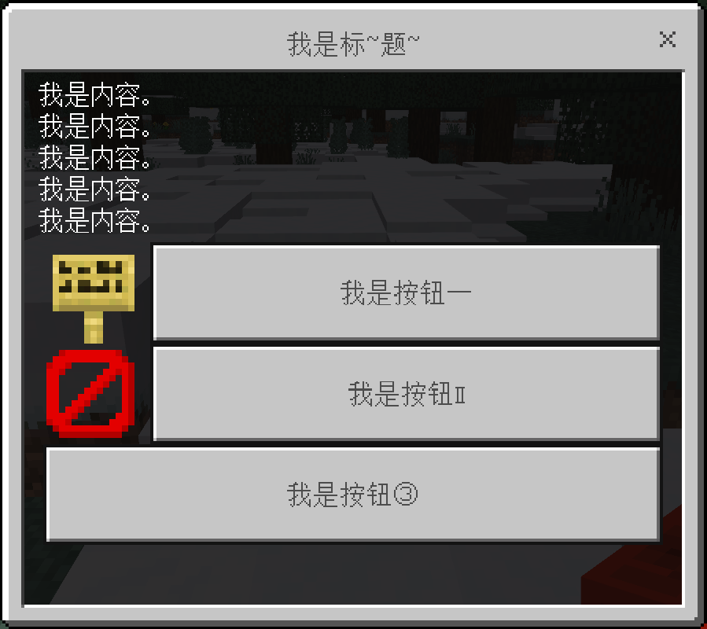

# 目录
- [目录](#目录)
- [效果图](#效果图)
- [警告](#警告)
- [综述](#综述)
  - [关键词](#关键词)
  - [目的](#目的)
  - [亮点](#亮点)
  - [拓展](#拓展)
- [使用教程](#使用教程)
  - [世界观](#世界观)
  - [指令概览](#指令概览)
  - [操作自定义表单](#操作自定义表单)
  - [编辑长表单及其中的按钮](#编辑长表单及其中的按钮)
  - [编辑信息表单](#编辑信息表单)
  - [编辑模态表单及其中的元素](#编辑模态表单及其中的元素)
  - [操作或执行自定义函数](#操作或执行自定义函数)
  - [编程语法](#编程语法)

# 效果图

# 警告
本模组因其具有非常高的自定义和灵活性而具有较高的上手难度。 
这是因为本模组允许服务器管理员通过**编程**来实现对服务器各个方面的控制。

尽管本模组会提供详尽的文档和解释来试图教会您如何编写代码， 
但如果您不是具有一定技术的指令师（或具有一定的先验知识）， 
则您不被推荐使用该模组来开发您的服务器（如山头服务器）。

当然，如果您打算在未来学习编程语言，那么我认为这个模组是个不错的选择。 
即便您认为该模组对您而言可能难以驾驭，您亦可将其介绍给您服务器的其他管理员（如指令师）。

# 综述
## 关键词
- 自定义表单、自定义菜单、自定义函数、事件侦听器、事件处理器
- 自定义指令、自定义命令
- 服务器开发、开发工具集、拓展包、开发者
- 指令师、指令、命令、命令方块
- 编程、编程大师、Python、表达式运算
- 高自由度、高灵活性、高扩展性

## 目的
**自定义菜单 & 服务器开发工具** 是一款适用于服务器开发场景的模组。 
它提供了**自定义菜单**、**自定义函数**和**服务器事件处理**的功能。

就目前而言，大部分服务器管理类的模组都依赖于管理员通过点击 **UI** 上的按钮（或者通过某种特殊的物品）来管理服务器。 
这意味着在模组非常多的情况下，可能会有非常多的，用于进入管理入口的按钮出现在屏幕上，可能会在一定程度上影响观感和游玩。

并且，绝大多数的这些模组都不支持使用者通过指令来实现对模组设置的修改（或者只支持了一部分）。 
无法通过指令修改这些设置会意味着一些东西必须只能由管理员手动进行操作（例如设置领地）， 
而这将导致整个流程必须与具有权限的玩家挂钩，而无法脱离这些玩家而流水线、自动地工作。

综上所述，该模组针对上面提出的问题提供了解决方案。 
即，本模组不会引进任何 **UI** 管理界面，这意味着所有操作都可以通过指令在命令方块完成。 
在大多数情况下，您只需要关注如何组织这些命令方块，并通过这些它们设计出完善的指令系统。

## 亮点
在现有的所有的自定义菜单（包括自定义任务）模组中，服务器管理员都无法很好**动态地**控制菜单要显示的内容。 
具体来说，服务器管理员会通过 **UI** 来输入菜单的文字。但在大多数情况下，一旦输入完毕，菜单的这些文字总是固定的、一成不变的。

如果您学习过 **Tellraw** 或者 **Titleraw** 指令，您就会发现 **Rawtext** 文本组件在一定程度上支持**动态地**显示实体的名称和分数。 
并且，如果您深入了解过 **Translate** 语句，您就会发现 **Rawtext** 文本组件在一定程度上还支持条件判断。

在这里，条件判断是指，在单个指令中可以根据某个条件（如玩家是否具有某个标签，玩家是否达到某个分数）而**动态地**显示不同的内容。 
在过去，这种方法通常需要通过多个命令方块来完成。然而，现在只需要一条指令，就可以实现类似彩虹血条的功能。

然而，上面提及的这种条件判断在实际上是非常难用的。如果条件非常多，则您可能需要对 **Translate** 语句多层嵌套。 
因此，本模组没有考虑引入 **Rawtext** 文本组件这种东西，而是将其替换为了一种编程语言来供指令师或服务器开发者进行操作。

所以，您将通过编写代码（而不是 **Rawtext** 文本组件）来控制菜单需要显示的内容。 
这意味着最终呈现的表单可以根据实际情况（比如玩家的标签或分数）来呈现不同的样式， 
并且这个过程中脱离了非常难用的 **Rawtext** 文本组件，从而极大地提高了易用性。

## 拓展
在上面的基础上，我们可以通过编写代码来控制菜单要显示的内容。 
但是如果只把写代码用在显示菜单这种小事上就有点杀鸡用牛刀了。 
基于此，本模组基于它可编程的特性，同时提供了**自定义函数**和**服务器事件处理**的功能。

简单地说，对于**自定义函数**，它的作用是允许您定义一段代码，然后之后就可以无限的使用它。 
相比于一个命令方块只能执行一条指令，您可以通过这种方式，通过一个命令方块执行多条指令。 
我们会在后面的文档中详细说明它的用途和使用方法，但现在您只需要知道**自定义函数**可以被重复使用。

对于**服务器事件处理**，您可以侦听服务器引擎的事件，然后便可以通过您在本模组编写的代码来处理它。 
这样的功能允许您自动化处理很多方面的事情，诸如对玩家发送的聊天进行处理，或处理玩家放置方块等。 
我们会在后面的文档中给出一些例子以方便您的理解，这里就不过多阐述了。

# 使用教程
*此段落的内容因篇幅原因仍在继续进行中。*

## 世界观
另见 [introduction.md](./additional/documents/introduction.md)

## 指令概览
另见 [commands/overview.md](./additional/documents/commands/overview.md)

## 操作自定义表单
另见 [commands/custom_form.md](./additional/documents/commands/custom_form.md)

## 编辑长表单及其中的按钮
另见 [commands/long_form.md](./additional/documents/commands/long_form.md)

## 编辑信息表单
另见 [commands/popup_form.md](./additional/documents/commands/popup_form.md)

## 编辑模态表单及其中的元素
另见 [commands/modal_form.md](./additional/documents/commands/modal_form.md)

## 操作或执行自定义函数
另见 [commands/custom_function.md](./additional/documents/commands/custom_function.md)

## 编程语法
另见 [Happy2018new/form-python-ast](https://github.com/Happy2018new/form-python-ast/tree/main?tab=readme-ov-file#%E7%BC%96%E7%A8%8B%E8%AF%AD%E6%B3%95)