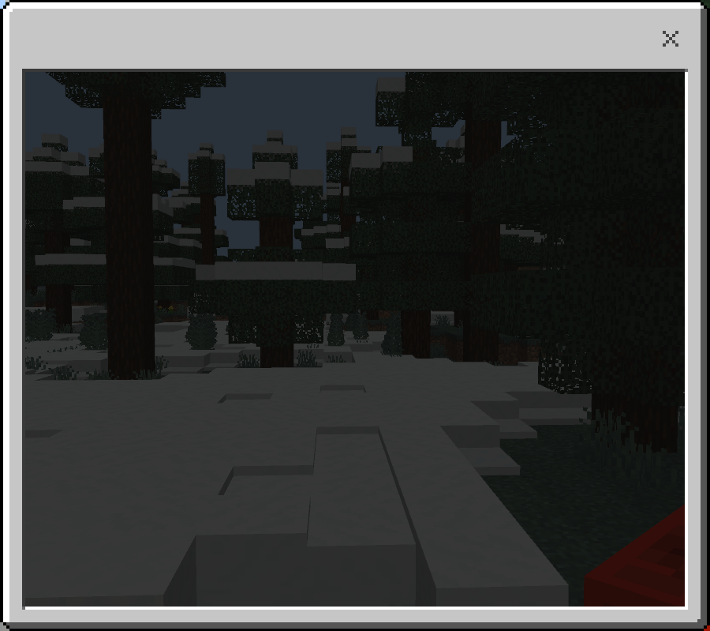
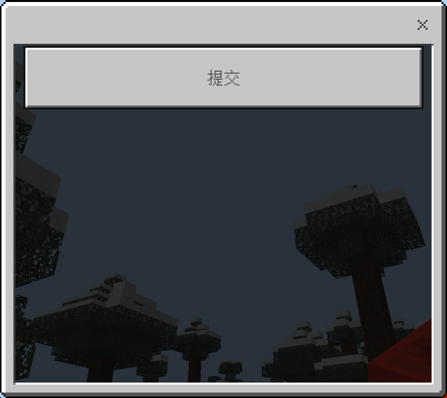

# 目录
- [目录](#目录)
- [指令概览](#指令概览)
- [添加表单](#添加表单)
  - [语法](#语法)
  - [备注](#备注)
  - [示例](#示例)
  - [效果](#效果)
- [列出表单](#列出表单)
  - [语法](#语法-1)
  - [示例](#示例-1)
  - [效果（示例）](#效果示例)
- [当表单被关闭时](#当表单被关闭时)
  - [语法](#语法-2)
  - [备注](#备注-1)
  - [示例](#示例-2)
  - [效果（示例）](#效果示例-1)
- [当表单被提交时](#当表单被提交时)
  - [语法](#语法-3)
  - [备注](#备注-2)
  - [示例](#示例-3)
  - [效果（示例）](#效果示例-2)
- [移除表单](#移除表单)
  - [语法](#语法-4)
  - [示例](#示例-4)
- [保存表单](#保存表单)
  - [语法](#语法-5)
  - [备注](#备注-3)
  - [示例](#示例-5)
- [显示表单](#显示表单)
  - [语法](#语法-6)
  - [备注](#备注-4)
  - [特别注意](#特别注意)
  - [示例](#示例-6)
- [强制关闭表单](#强制关闭表单)
  - [语法](#语法-7)
  - [备注](#备注-5)
  - [示例](#示例-7)


# 指令概览
```mcfunction
customform add <name: string> long|popup|modal
customform list [name: string]
customform oncancel <name: string> <code: string> [onCodeError: string]
customform onsubmit <name: string> <code: string> [onCodeError: string]
customform remove <name: string>
customform save <name: string>
customform show <executor: target> <position: x y z> <player: target> <name: string>
customform close <player: target>
```


# 添加表单
## 语法
添加名为 `<name: string>` 的表单。
```mcfunction
customform add <name: string> long|popup|modal
```


## 备注
枚举值 `long|popup|modal` 的含义如下。
- long: 长表单
- popup: 信息表单
- modal: 模态表单


## 示例
```mcfunction
# 添加名为 ABC 的长表单
customform add ABC long

# 添加名为 test 的信息表单
customform add test popup

# 添加名为 你好 的模态表单
customform add 你好 modal
```


## 效果
在添加长表单、信息表单和模态表单后，它们的默认形式从左到右依次如下图所示。




# 列出表单
## 语法
列出所有表单的类型，或仅查询 `[name: string]` 所指示的表单的类型。
```mcfunction
customform list [name: string]
```


## 示例
```mcfunction
# 列出所有表单的名称和类型
customform list

# 查询表单 AABBCC 的类型
customform list AABBCC
```


## 效果（示例）
如果是列出所有表单的名称和类型：
```
当前已注册了 2 个表单:
  - AABBCC: 长表单
  - test: 信息表单
```

如果是查询一个表单的类型：
```
名为 "AABBCC" 的表单的类型为长表单
```


# 当表单被关闭时
## 语法
设置表单被关闭时要执行的代码。
```mcfunction
customform oncancel <name: string> <code: string> [onCodeError: string]
```

| 参数                  | 数据类型 | 备注 | 解释                                               |
| --------------------- | -------- | ---- | -------------------------------------------------- |
| <name: string>        | 字符串   | 必填 | 目标表单的名字                                     |
| <code: string>        | 字符串   | 必填 | 表单被关闭时，要执行的代码                         |
| [onCodeError: string] | 字符串   | 选填 | 上面的代码执行出错时，要执行的代码（用于错误处理） |


## 备注
表单被关闭只可能因为下面的原因。
- 玩家手动点击了表单右上角的叉号
- 玩家当前正忙（如打开了聊天栏）

判断是否正忙的一个方法是您是否可以直接与游戏中的方块产生交互。<br/>
例如您无法在打开聊天栏的情况下点击方块，您必须关闭这些界面，然后才能点击方块。

另外，如果您不知道编写的代码的方法，请参见...


## 示例
```mcfunction
customform oncancel alice

"
reason = {ref, int, -1}
{command, 'say 表单被关闭了，原因是 ' + str(reason)}
0/0
"

"
{command, 'say 错误: ' + str(error)}
"
```


## 效果（示例）
```
[Eternal] 表单被关闭了，原因是 0
[Eternal] 错误: Runtime Error.

- Error -
  integer division or modulo by zero

- Code -
  0/0
```


# 当表单被提交时
## 语法
设置表单被提交时要执行的代码。
```mcfunction
customform onsubmit <name: string> <code: string> [onCodeError: string]
```

| 参数                  | 数据类型 | 备注 | 解释                                               |
| --------------------- | -------- | ---- | -------------------------------------------------- |
| <name: string>        | 字符串   | 必填 | 目标表单的名字                                     |
| <code: string>        | 字符串   | 必填 | 表单被提交时，要执行的代码                         |
| [onCodeError: string] | 字符串   | 选填 | 上面的代码执行出错时，要执行的代码（用于错误处理） |


## 备注
- 长表单
  - 提交意味着玩家点击了长表单中的任何一个按钮（不包括叉号）
- 信息表单
  - 提交意味着玩家点击了代表“确定”或“取消”的按钮
- 模态表单
  - 提交意味着玩家点击了“提交”按钮

另外，如果您不知道编写的代码的方法，请参见...


## 示例
```mcfunction
customform onsubmit "233"

"
{command, 'say 我提交了'}
{command, 'say ' + 0}
"

"
{command, 'w @a error=' + str(error)}
"
```


## 效果（示例）
```
[Eternal] 我提交了
<Eternal> Eternal悄悄地对你说:error=Runtime Error.

          - Error -
            cannot concatenate 'str' and 'int' objects
          
          - Code -
            {command, 'say ' + 0}
```


# 移除表单
## 语法
移除名为 `<name: string>` 的表单。
```mcfunction
customform remove <name: string>
```


## 示例
```mcfunction
# 移除名为 Steve 的表单
customform remove Steve

# 移除名为 233 的表单
customform remove "233"
```


# 保存表单
## 语法
将表单 `<name: string>` 的配置保存到磁盘（存档）。
```mcfunction
customform save <name: string>
```


## 备注
要持久化地保存表单，您必须使用该命令保存配置。<br/>
如果您不这么做，则表单的新配置会在重进存档后丢失。

特别地，如果您在创建一个表单后从未保存它，<br/>
在重进存档后，该表单会连同它之前的配置一同消失。

这意味着您可以创建非常多的临时性表单而不需要保存它们，<br/>
从而您可以在临时表单相关的指令系统上获得更高的效率和性能。


## 示例
```mcfunction
# 保存表单 "Hello, World!"
customform save "Hello, World!"
```


# 显示表单
## 语法
向指定的玩家显示（打开）表单。
```mcfunction
customform show <executor: target> <position: x y z> <player: target> <name: string>
```

| 参数               | 数据类型   | 备注 | 解释                   |
| ------------------ | ---------- | ---- | ---------------------- |
| <executor: target> | 目标选择器 | 必填 | 命令执行者             |
| <position: x y z>  | 坐标       | 必填 | 命令执行点             |
| <player: target>   | 目标选择器 | 必填 | 要向谁显示（打开）表单 |
| <name: string>     | 字符串     | 必填 | 要显示（打开）的表单   |


## 备注
因为表单最终呈现的内容都是由代码构建的（您会在后面的文档中理解这一点），<br/>
而构建这些内容的过程中需要用到命令执行上下文（因为您可能向内容中插入实体名或分数）。

因此，您需要指定执行那些代码时所用的命令执行者和命令执行点。<br/>
您无需指定命令执行维度，因为我们将采用执行该 `customform` 命令时所使用的维度作为命令执行维度。

特别地，受制于目前的接口限制，无法继承除命令执行者、<br/>
命令执行点和命令执行维度之外的其他命令执行上下文。

需要注意的是，命令执行者至多设置一个，设置多个命令执行者将导致命令执行失败。<br/>
另外，`<player: target>, <executor: target>, <position: x y z>` 之间没有显式联系。


## 特别注意
如果目标玩家正忙（比如打开了聊天栏，打开了命令方块，打开了容器等），<br/>
则执行该命令后，表单不会向目标玩家显示（或打开），这是因为玩家正忙。

这意味着如果您在聊天栏内执行向你自己打开表单的命令，<br/>
则相应的表单不会打开，这是因为您的聊天栏还没有完全关闭。

因此，请确保您总是通过命令方块来打开表单。<br/>
或者，您可以确保该指令在被执行时，您不是正忙。

另外一点是，你不应该反复的执行显示（打开）表单的命令。<br/>
每一次请求都意味着向玩家的客户端发送表单打开请求，<br/>
短时间内大量的产生这样的请求会造成服务器和玩家同时卡顿！

对于判断是否正忙，一个方法是玩家是否可以直接与游戏中的方块产生交互。<br/>
例如您无法在打开聊天栏、命令方块或箱子的情况下点击方块。<br/>
在通常的情况下，必须要手动关闭这些界面，然后才能点击方块。


## 示例
向玩家 `@a[tag=ppt]` 显示（打开）表单 `a0`。<br/>
表单中的代码则分别使用 `@e[tag=abc]` 和 `~ ~ ~` 所指示的命令执行者和命令执行点。

```mcfunction
customform show @e[tag=abc] ~ ~ ~ @a[tag=ppt] a0
```


# 强制关闭表单
## 语法
强制关闭指定玩家已经打开的表单。
```mcfunction
customform close <player: target>
```


## 备注
如果某玩家正在打开一个表单（但还没有完全打开），<br/>
则使用该指令不会关闭这个正在被打开的表单。

特别地，如果一个表单正在被关闭（但还没有完全关闭），<br/>
然后现在刚好要显示（打开）一个新的表单，<br/>
则该命令可以在这个新的表单在开始打开前阻止它。

应注意的是，服务器的强制性表单关闭请求亦属于表单的关闭。<br/>
并且，这种关闭应被视作正常关闭，而非因用户正忙而被关闭。

在强制关闭请求发出后，如果操作成功生效，<br/>
则将会执行在 `oncancel` 子命令设置的代码。


## 示例
```mcfunction
# 关闭所有人已经打开的表单
customform close @a
```