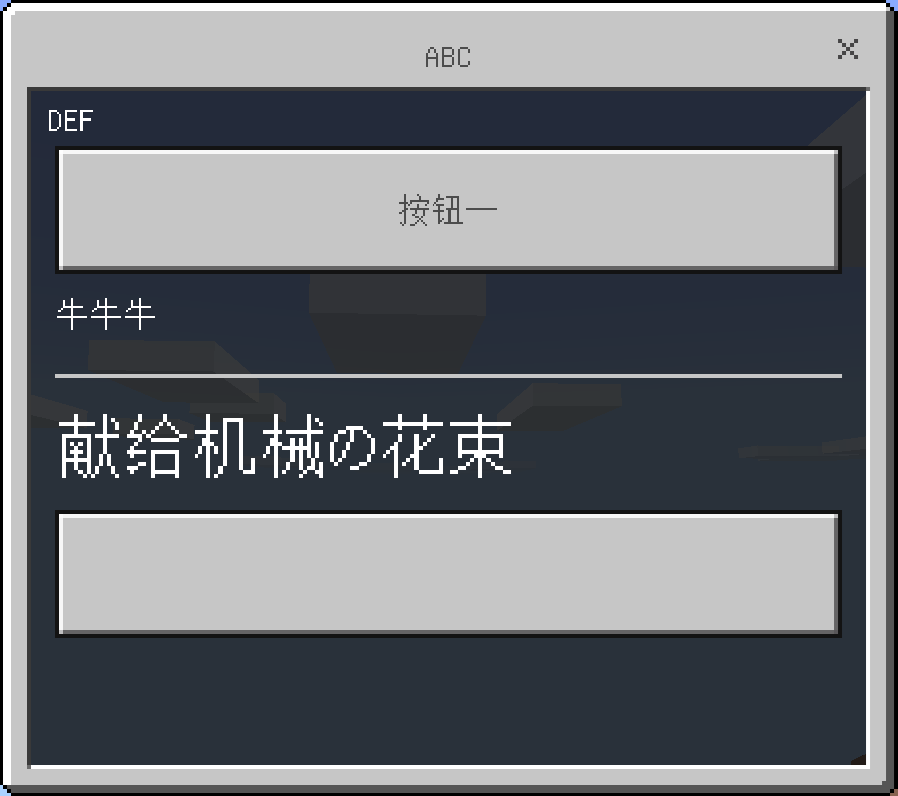
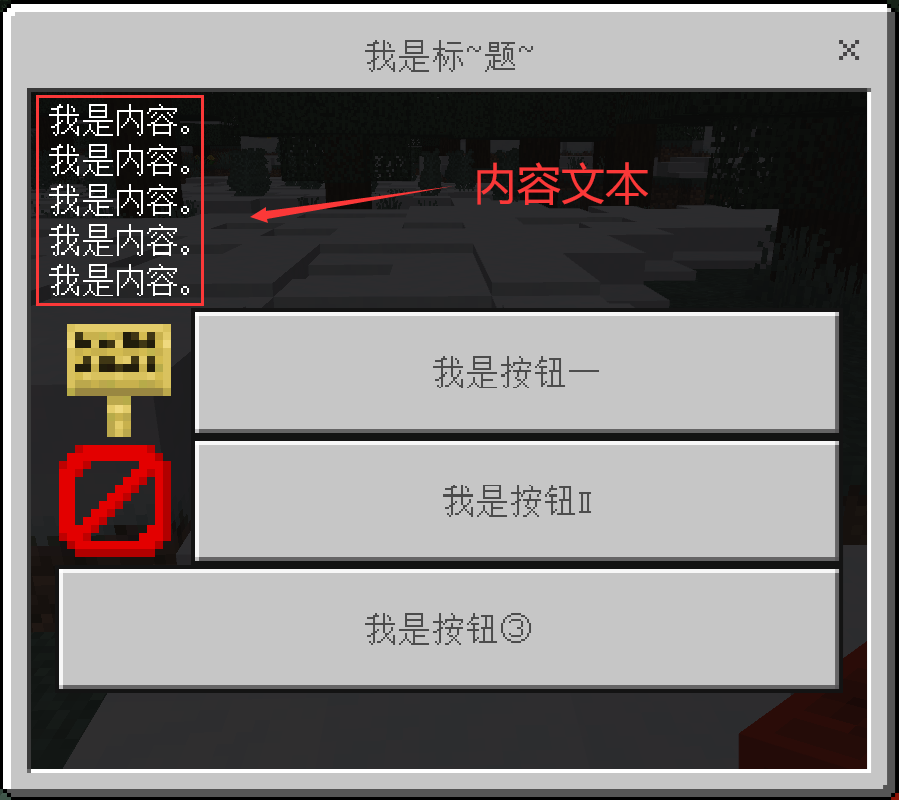
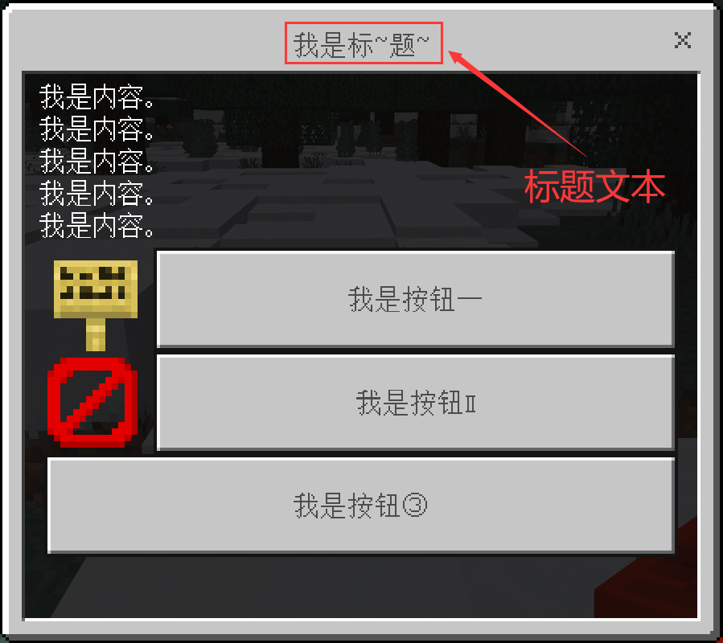
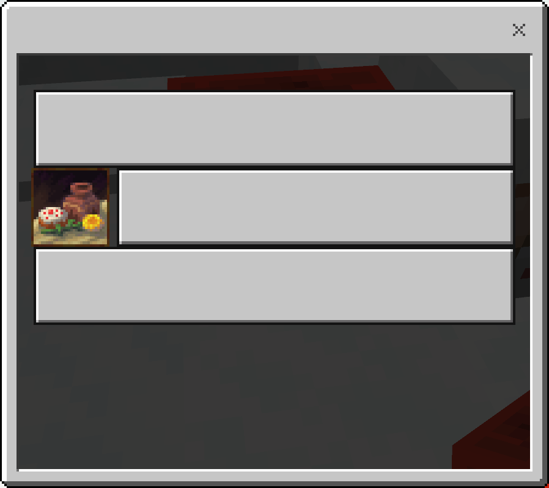
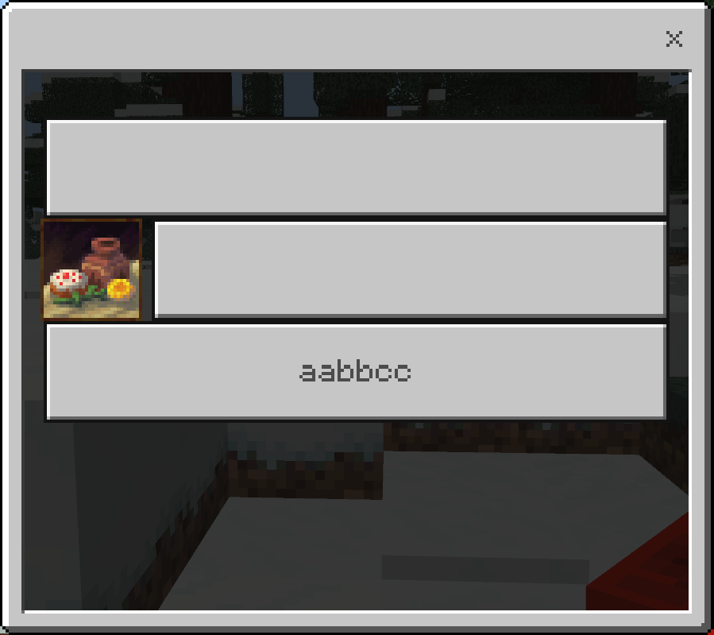

# 目录
- [目录](#目录)
- [指令概览](#指令概览)
  - [编辑长表单](#编辑长表单)
  - [编辑长表单中的按钮](#编辑长表单中的按钮)
- [编辑长表单](#编辑长表单-1)
  - [添加按钮](#添加按钮)
    - [语法](#语法)
    - [示例](#示例)
  - [设置内容文本](#设置内容文本)
    - [语法](#语法-1)
    - [示例](#示例-1)
  - [插入按钮](#插入按钮)
    - [语法](#语法-2)
    - [备注](#备注)
    - [补充](#补充)
    - [示例](#示例-2)
  - [列出按钮](#列出按钮)
    - [语法](#语法-3)
    - [示例](#示例-3)
    - [效果（示例）](#效果示例)
  - [弹出按钮](#弹出按钮)
    - [语法](#语法-4)
    - [备注](#备注-1)
    - [示例](#示例-4)
  - [截断按钮](#截断按钮)
    - [语法](#语法-5)
    - [备注](#备注-2)
    - [补充](#补充-1)
    - [示例](#示例-5)
  - [设置标题文本](#设置标题文本)
    - [语法](#语法-6)
    - [示例](#示例-6)
- [编辑长表单中的按钮](#编辑长表单中的按钮-1)
  - [设置图标](#设置图标)
    - [语法](#语法-7)
    - [备注](#备注-3)
    - [补充](#补充-2)
    - [示例](#示例-7)
    - [效果（示例）](#效果示例-1)
  - [设置文字](#设置文字)
    - [语法](#语法-8)
    - [补充](#补充-3)
    - [示例](#示例-8)
    - [效果（示例）](#效果示例-2)


# 指令概览
## 编辑长表单
```mcfunction
editlongform <formName: string> append
editlongform <formName: string> content <contentCode: string>
editlongform <formName: string> insert <index: int>
editlongform <formName: string> list
editlongform <formName: string> pop left|right
editlongform <formName: string> sub keep|discard <startIndex: int> <endIndex: int>
editlongform <formName: string> title <titleCode: string>
```


## 编辑长表单中的按钮
```mcfunction
editbutton <formName: string> <buttonIndex: int> icon [textureCode: string]
editbutton <formName: string> <buttonIndex: int> text <textCode: string>
```


# 编辑长表单
## 添加按钮
### 语法
向长表单 `<formName: string>` 添加（追加）一个按钮。
```
editlongform <formName: string> append
```




### 示例
```mcfunction
# 向长表单 Happy 添加一个按钮
editlongform Happy append
```


## 设置内容文本
### 语法
设置长表单要显示的内容文本。
```
editlongform <formName: string> content <contentCode: string>
```

| 参数                  | 数据类型 | 备注 | 解释                   |
| --------------------- | -------- | ---- | ---------------------- |
| <formName: string>    | 字符串   | 必填 | 被编辑的长表单的名字   |
| <contentCode: string> | 字符串   | 必填 | 用于生成内容文本的代码 |




### 示例
设置长表单 `i_am_a_boy` 的内容文本，并且内容文本总是固定的 `你好`。
```mcfunction
editlongform i_am_a_boy content "return '你好'"
```


## 插入按钮
### 语法
在长表单 `<formName: string>` 的索引 `<index: int>` 处插入一个按钮。
```mcfunction
editlongform <formName: string> insert <index: int>
```


### 备注
要在第一个按钮前插入一个按钮，索引值应使用 0。<br/>
要在第一个按钮后插入一个按钮，索引值应使用 1。

要在第 `i` 个按钮前插入一个按钮，索引值应使用 `i-1`。<br/>
要在第 `i` 个按钮后插入一个按钮，索引值应使用 `i`。

如果一个按钮的索引是 `i`，则要在它之前插入一个按钮，应使用 `i`。<br/>
如果一个按钮的索引是 `i`，则要在它之后插入一个按钮，应使用 `i+1`。


### 补充
第 1 个按钮的索引值是 0。<br/>
第 2 个按钮的索引值是 1。<br/>
第 3 个按钮的索引值是 2。<br/>
...<br/>
第 n 个按钮的索引值是 n-1。


### 示例
```mcfunction
# 在 bbc 长表单的第三个按钮前插入一个按钮
editlongform bbc insert 2

# 在 bbc 长表单的第三个按钮后插入一个按钮
editlongform bbc insert 3
```


## 列出按钮
### 语法
列出长表单 `<formName: string>` 中按钮的数量，以及它们是否使用了图标。
```mcfunction
editlongform <formName: string> list
```


### 示例
```mcfunction
# 列出长表单 a 中的所有按钮情况
editlongform a list
```


### 效果（示例）
```
长表单 "a" 目前已存在 3 个按钮:
  - 使用材质贴图
  - 无图标
  - 无图标
```


## 弹出按钮
### 语法
弹出（移除）长表单 `<formName: string>` 中的第一个按钮或最后一个按钮。
```mcfunction
editlongform <formName: string> pop left|right
```


### 备注
枚举值 `left|right` 的含义如下。
- left: 弹出（移除）第一个按钮
- right: 弹出（移除）最后一个按钮


### 示例
```mcfunction
# 移除长表单 rta 中的最后一个按钮
editlongform rta pop right

# 移除长表单 rta 中的第一个按钮
editlongform rta pop left
```


## 截断按钮
### 语法
只保留或只丢弃长表单中的一部分按钮。
```mcfunction
editlongform <formName: string> sub keep|discard <startIndex: int> <endIndex: int>
```


| 参数               | 数据类型 | 备注 | 解释                 |
| ------------------ | -------- | ---- | -------------------- |
| <formName: string> | 字符串   | 必填 | 被编辑的长表单的名字 |
| keep\|discard      | 枚举值   | 必填 | 操作类型             |
| <startIndex: int>  | 整数     | 必填 | 涉及的按钮的起始索引 |
| <endIndex: int>    | 整数     | 必填 | 涉及的按钮的结束索引 |


### 备注
枚举值 `keep|discard` 的含义如下。
- keep: 只保留长表单中的一部分按钮
- discard: 只丢弃长表单中的一部分按钮


要只保留（丢弃）第 1、2、3 个按钮：
- `<startIndex: int>` 填 `0`
- `<endIndex: int>` 填 `3`


要只保留（只丢弃）第 `a、a+1、a+2、...、a+n` 个按钮：
- `<startIndex: int>` 填 `a-1`
- `<endIndex: int>` 填 `a+n`

要只保留（只丢弃）索引为 `b、b+1、b+2、...、b+n` 的按钮：
- `<startIndex: int>` 填 `b`
- `<endIndex: int>` 填 `b+n+1`

要只保留（只丢弃）索引为 `c` 以及它后面的按钮，并且总共只选择 `n` 个：
- `<startIndex: int>` 填 `c`
- `<endIndex: int>` 填 `c+n`


### 补充
第 1 个按钮的索引值是 0。<br/>
第 2 个按钮的索引值是 1。<br/>
第 3 个按钮的索引值是 2。<br/>
...<br/>
第 n 个按钮的索引值是 n-1。


### 示例
```mcfunction
# 只保留长表单 rtx 中的第三、四、五、六个按钮，剩余的丢弃
editlongform rtx sub keep 2 6

# 只移除长表单 rtx 中的第三、四、五、六个按钮，保留剩余的
editlongform rtx sub discard 2 6
```


## 设置标题文本
### 语法
设置长表单要显示的标题文本。
```
editlongform <formName: string> title <titleCode: string>
```

| 参数                | 数据类型 | 备注 | 解释                   |
| ------------------- | -------- | ---- | ---------------------- |
| <formName: string>  | 字符串   | 必填 | 被编辑的长表单的名字   |
| <titleCode: string> | 坐标     | 必填 | 用于生成标题文本的代码 |




### 示例
设置长表单 `bds` 的标题文本，<br/>
并且内容文本是显示表单时设置的命令执行者的名字。

```mcfunction
editlongform bds title "return {selector, '@s'}"
```


# 编辑长表单中的按钮
## 设置图标
### 语法
设置指定长表单中指定按钮的图标
```mcfunction
editbutton <formName: string> <buttonIndex: int> icon [textureCode: string]
```

| 参数                  | 数据类型 | 备注 | 解释                         |
| --------------------- | -------- | ---- | ---------------------------- |
| <formName: string>    | 字符串   | 必填 | 被编辑的长表单的名字         |
| <buttonIndex: int>    | 整数     | 必填 | 被编辑的按钮在长表单中的索引 |
| [textureCode: string] | 字符串   | 选填 | 用于生成图标的代码           |


### 备注
`[textureCode: string]` 所使用的代码应返回一个字符串。<br/>
这个字符串指向了相应按钮所使用的图标在 MC 中的材质贴图路径。<br/>
当然，您可以不填写这个字符串，从而将该按钮设置为没有图标。


### 补充
第 1 个按钮的索引值是 0。<br/>
第 2 个按钮的索引值是 1。<br/>
第 3 个按钮的索引值是 2。<br/>
...<br/>
第 n 个按钮的索引值是 n-1。


### 示例
```
# 将长表单 abc 中第二个按钮的贴图设置为一幅画作
editbutton abc 1 icon "return 'textures/painting/baroque'"
```


### 效果（示例）



## 设置文字
### 语法
设置指定长表单中指定按钮的文字
```mcfunction
editbutton <formName: string> <buttonIndex: int> text <textCode: string>
```

| 参数               | 数据类型 | 备注 | 解释                         |
| ------------------ | -------- | ---- | ---------------------------- |
| <formName: string> | 字符串   | 必填 | 被编辑的长表单的名字         |
| <buttonIndex: int> | 整数     | 必填 | 被编辑的按钮在长表单中的索引 |


### 补充
第 1 个按钮的索引值是 0。<br/>
第 2 个按钮的索引值是 1。<br/>
第 3 个按钮的索引值是 2。<br/>
...<br/>
第 n 个按钮的索引值是 n-1。


### 示例 
```
# 将长表单 abc 中索引为 2 的按钮的文字设置为固定的 aabbcc
editbutton abc 2 text "return 'aabbcc'"
```


### 效果（示例）
