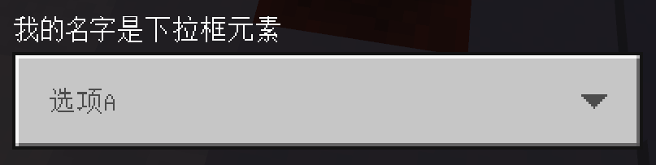
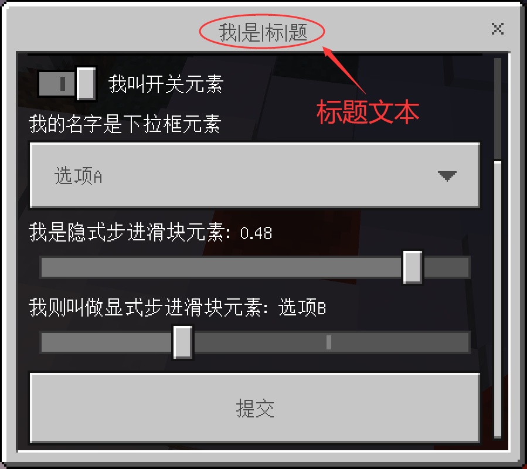

# 目录
- [目录](#目录)
- [指令概览](#指令概览)
  - [编辑模态表单](#编辑模态表单)
  - [编辑模态表单中的普通文本](#编辑模态表单中的普通文本)
  - [编辑模态表单中的输入框](#编辑模态表单中的输入框)
  - [编辑模态表单中的开关](#编辑模态表单中的开关)
  - [编辑模态表单中的下拉框](#编辑模态表单中的下拉框)
  - [编辑模态表单中的隐式步进滑块](#编辑模态表单中的隐式步进滑块)
  - [编辑模态表单中的显式步进滑块](#编辑模态表单中的显式步进滑块)
- [编辑模态表单](#编辑模态表单-1)
  - [添加元素](#添加元素)
    - [语法](#语法)
    - [备注一](#备注一)
    - [备注二](#备注二)
    - [示例](#示例)
  - [插入元素](#插入元素)
    - [语法](#语法-1)
    - [备注](#备注)
    - [示例](#示例-1)
  - [列出元素](#列出元素)
    - [语法](#语法-2)
    - [示例](#示例-2)
    - [效果（示例）](#效果示例)
  - [弹出元素](#弹出元素)
    - [语法](#语法-3)
    - [备注](#备注-1)
    - [示例](#示例-3)
  - [截断元素](#截断元素)
    - [语法](#语法-4)
    - [备注一](#备注一-1)
    - [备注二](#备注二-1)
    - [示例](#示例-4)
  - [设置标题文本](#设置标题文本)
    - [语法](#语法-5)
    - [示例](#示例-5)


# 指令概览
## 编辑模态表单
```mcfunction
editmodalform <formName: string> append label|input|toggle|dropdown|slider|stepslider
editmodalform <formName: string> insert <index: int> label|input|toggle|dropdown|slider|stepslider
editmodalform <formName: string> list
editmodalform <formName: string> pop left|right
editmodalform <formName: string> sub keep|discard <startIndex: int> <endIndex: int>
editmodalform <formName: string> title <titleCode: string>
```


## 编辑模态表单中的普通文本
```mcfunction
editlabel <formName: string> <index: int> label <labelCode: string>
```


## 编辑模态表单中的输入框
```mcfunction
editinput <formName: string> <index: int> default <defaultCode: string>
editinput <formName: string> <index: int> placeholder <placeHolderCode: string>
editinput <formName: string> <index: int> text <textCode: string>
```


## 编辑模态表单中的开关
```mcfunction
edittoggle <formName: string> <index: int> default <stateCode: string>
edittoggle <formName: string> <index: int> text <textCode: string>
```


## 编辑模态表单中的下拉框
```mcfunction
editdropdown <formName: string> <index: int> append <optionCode: string>
editdropdown <formName: string> <index: int> default <indexCode: string>
editdropdown <formName: string> <index: int> insert <index: int> <optionCode: string>
editdropdown <formName: string> <index: int> list
editdropdown <formName: string> <index: int> pop left|right
editdropdown <formName: string> <index: int> sub keep|discard <startIndex: int> <endIndex: int>
editdropdown <formName: string> <index: int> text <textCode: string>
```


## 编辑模态表单中的隐式步进滑块
```mcfunction
editslider <formName: string> <index: int> default <defaultCode: string>
editslider <formName: string> <index: int> min <minCode: string>
editslider <formName: string> <index: int> max <maxCode: string>
editslider <formName: string> <index: int> step <stepCode: string>
editslider <formName: string> <index: int> text <textCode: string>
```


## 编辑模态表单中的显式步进滑块
```mcfunction
editstepslider <formName: string> <index: int> append <stepCode: string>
editstepslider <formName: string> <index: int> default <indexCode: string>
editstepslider <formName: string> <index: int> insert <index: int> <stepCode: string>
editstepslider <formName: string> <index: int> list
editstepslider <formName: string> <index: int> pop left|right
editstepslider <formName: string> <index: int> sub keep|discard <startIndex: int> <endIndex: int>
editstepslider <formName: string> <index: int> text <textCode: string>
```


# 编辑模态表单
## 添加元素
### 语法
向模态表单 `<formName: string>` 添加（追加）一个元素。
```mcfunction
editmodalform <formName: string> append label|input|toggle|dropdown|slider|stepslider
```

| 元素 ID    | 元素名称           | 图例                                                                                  |
| ---------- | ------------------ | ------------------------------------------------------------------------------------- |
| label      | 普通文本（纯文本） |        |
| input      | 输入框             |       |
| toggle     | 开关               |       |
| dropdown   | 下拉框             |    |
| slider     | 隐式步进滑块       |       |
| stepslider | 显式步进滑块       |  |


### 备注一
通过该方式添加的元素后，您需要通过其他指令来进一步编辑它们。<br/>
这意味着通过该方式添加的元素在一开始都保持下面列出的默认状态。

- 普通文本（纯文本）
  - 空文本
- 输入框
  - 标题文本为空文本
  - 输入框提示语为空文本
  - 输入框的已输入内容（默认内容）为空文本
- 开关
  - 标题文本为空文本
  - 开关默认保持关闭
- 下拉框
  - 标题文本为空文本
  - **默认没有任何选项**
- 隐式步进滑块
  - 标题文本为空文本
  - 最小值为 0.0
  - 最大值为 1.0
  - 单次步进长度为 1.0
  - 默认值为 0.0
- 显式步进滑块
  - 标题文本为空文本
  - **默认没有任何选项**


### 备注二
在通过指令向玩家展示（打开）模态表单时，<br/>
我们对 `下拉框` 和 `显式步进滑块` 具有下面的限制。

- 模态表单中的每个 `下拉框` 必须要有**至少 1 个选项**
- 模态表单中的每个 `显式步进滑块` 必须要有**至少 2 个选项**

您需要通过其他指令来编辑添加的 `下拉框` 和 `显式步进滑块`，<br/>
以使得它们的选项数量达到最低要求（或超过最低要求）。


### 示例
```mcfunction
# 向模态表单 你好 添加一个普通文本（纯文本）
editmodalform 你好 append label

# 向模态表单 happy2018new 添加一个输入框
editmodalform happy2018new append input

# 向模态表单 bb 添加一个开关
editmodalform bb append toggle

# 向模态表单 hello 添加一个下拉框
editmodalform hello append dropdown

# 向模态表单 233 添加一个隐式步进滑块
editmodalform "233" append slider

# 向模态表单 my_form 添加一个显式步进滑块
editmodalform my_form append stepslider
```


## 插入元素
### 语法
在模态表单 `<formName: string>` 的索引 `<index: int>` 处插入一个元素。
```mcfunction
editmodalform <formName: string> insert <index: int> label|input|toggle|dropdown|slider|stepslider
```


### 备注
插入元素的行为和添加元素的行为保持一致。它们的唯一区别在于插入元素可以指定插入的位置。<br/>
另外，如果您不知道什么是索引，请参看 [编辑长表单 § 插入按钮](./long_form.md#插入按钮)。


### 示例
下述所有指令都是在模态表单 `a0` 上操作的。

```mcfunction
# 在第一个元素的后面插入一个开关
editmodalform a0 insert 1 toggle

# 在第三个元素的前面插入一个隐式步进滑块
editmodalform a0 insert 2 toggle
```


## 列出元素
### 语法
列出模态表单 `<formName: string>` 中的所有元素。
```mcfunction
editmodalform <formName: string> list
```


### 示例
```mcfunction
# 列出模态表单 cookie 中的所有元素
editmodalform cookie list
```


### 效果（示例）
```
模态表单 "cookie" 目前已存在 4 个元素:
  - 普通文本
  - 普通文本
  - 普通文本
  - 开关
```


## 弹出元素
### 语法
弹出（移除）模态表单 `<formName: string>` 中的第一个元素或最后一个元素。
```mcfunction
editmodalform <formName: string> pop left|right
```


### 备注
枚举值 `left|right` 的含义如下。
- left: 弹出（移除）第一个元素
- right: 弹出（移除）最后一个元素


### 示例
```mcfunction
# 移除模态表单 yorha 中的第一个元素
editmodalform yorha pop left

# 移除模态表单 2018 中的最后一个元素
editmodalform "2018" pop right
```


## 截断元素
### 语法
只保留或只丢弃模态表单中的一部分元素。
```mcfunction
editmodalform <formName: string> sub keep|discard <startIndex: int> <endIndex: int>
```


| 参数               | 数据类型 | 备注 | 解释                   |
| ------------------ | -------- | ---- | ---------------------- |
| <formName: string> | 字符串   | 必填 | 被编辑的模态表单的名字 |
| keep\|discard      | 枚举值   | 必填 | 操作类型               |
| <startIndex: int>  | 整数     | 必填 | 涉及的元素的起始索引   |
| <endIndex: int>    | 整数     | 必填 | 涉及的元素的结束索引   |


### 备注一
枚举值 `keep|discard` 的含义如下。
- keep: 只保留模态表单中的一部分元素
- discard: 只丢弃模态表单中的一部分元素


### 备注二
模态表单的截断元素的行为与 [编辑长表单 § 截断按钮](./long_form.md#截断按钮) 的行为基本一致。<br/>
它们在本质上并没有太大的区别，因此本处不再赘述截断元素在编辑模态表单中的用法。


### 示例
```mcfunction
# 只保留模态表单 super 中的第一、二、三、四、五个元素，剩余的丢弃
editmodalform super sub keep 0 5

# 只移除模态表单 bbc 中的第二、三、四、五、六个元素，保留剩余的
editmodalform bbc sub discard 1 6
```


## 设置标题文本
### 语法
设置模态表单要显示的标题文本。
```mcfunction
editmodalform <formName: string> title <titleCode: string>
```

| 参数                | 数据类型 | 备注 | 解释                   |
| ------------------- | -------- | ---- | ---------------------- |
| <formName: string>  | 字符串   | 必填 | 被编辑的模态表单的名字 |
| <titleCode: string> | 坐标     | 必填 | 用于生成标题文本的代码 |




### 示例
```mcfunction
# 设置模态表单 “good night today!” 的标题文本为 “我|是|标|题”
editmodalform "good night today!" title "return '我|是|标|题'"

# 设置模态表单 aaaaa 的标题文本为 我我是是标标题题
editmodalform aaaaa title "return '我我是是标标题题'"
```