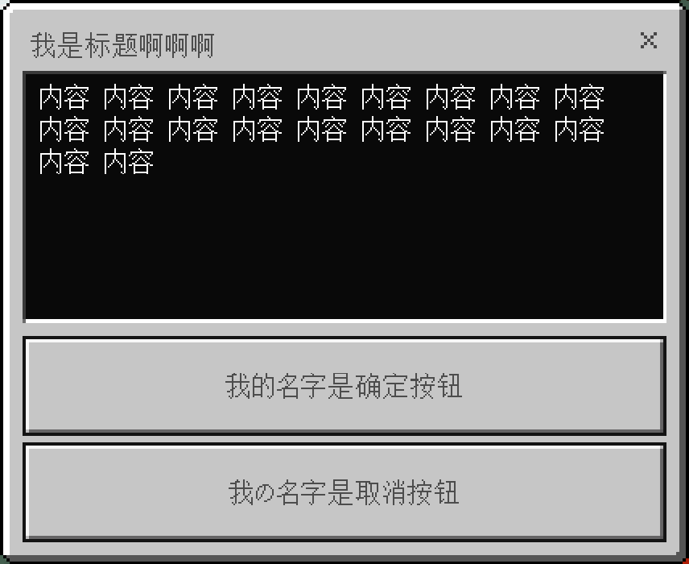
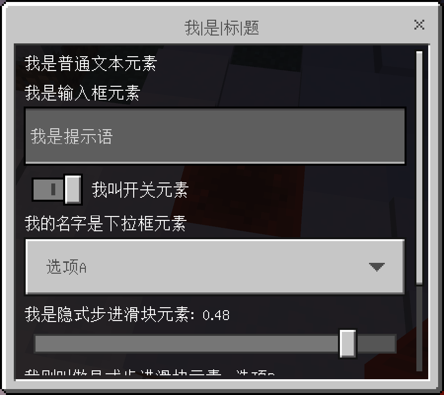
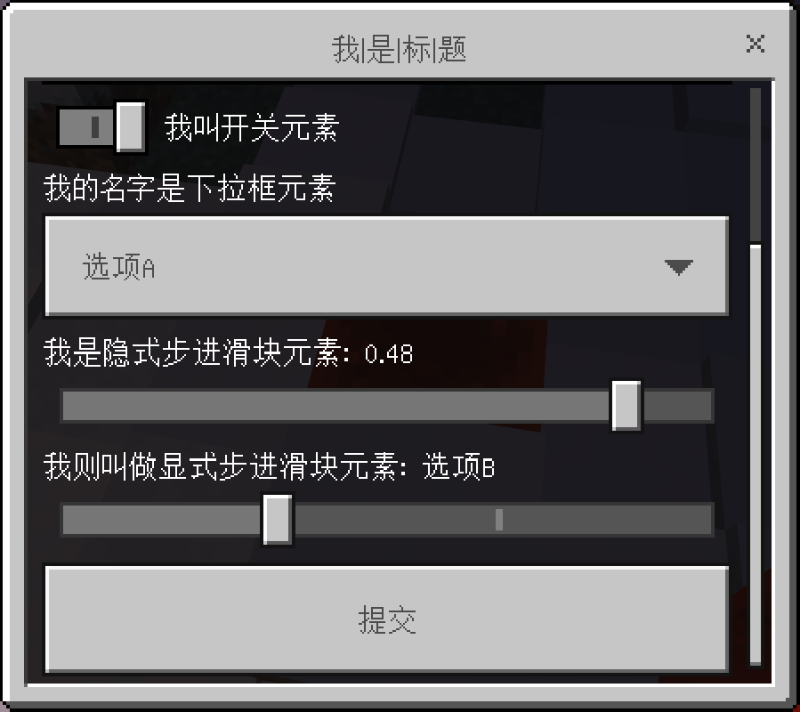

# 目录
- [目录](#目录)
- [引言](#引言)
- [长表单](#长表单)
- [信息表单](#信息表单)
- [模态表单](#模态表单)

# 引言
**自定义菜单**，又名**自定义表单**，是一种玩家和服务器的一套可视化交互系统。 
它提供了实际的界面，允许玩家通过点击按钮或填写内容的方式来完成交互。

它不同于雪球菜单，需要玩家通过雪球、上下抬头或视角旋转的方式。 
也不同于箱子菜单，需要玩家通过点击（或移动）箱子中的物品。

自定义菜单一共有三种，分为**长表单**、**信息表单**和**模态表单**。 
接下来，让我们分别认识这三个表单，以及这三个表单上可以存在的元素。

# 长表单
如下图，**长表单**由以下几个部分组成。
- 标题文本
- 内容文本
- 各个按钮

另外，每个按钮可以指定它是否需要图标。 
并且，**长表单**实际上可以不存在任何按钮。

在玩家实际与**长表单**交互时，玩家只能点击其中一个按钮。 
在玩家点击任何一个按钮之后，该**长表单**将会被立即关闭。 
当然，玩家亦可选择点击右上角的叉号来关掉**长表单**。

 

# 信息表单
如下图，**信息表单**由以下几个部分组成。
- 标题文本
- 内容文本
- 代表“确定”的按钮
- 代表“取消”的按钮

在玩家实际与**信息表单**交互时，玩家要么点击代表“确定”的按钮，要么点击代表“取消”的按钮。 
与**长表单**的运作逻辑相同，在玩家点击任何一个按钮后（包括叉号），**信息表单**将被立即关闭。

 

# 模态表单
**模态表单**是最复杂的表单，它由**标题文本**和**模态表单元素**组成。 
下面的这两张图列出了**模态表单**中可以存在的所有元素。

要注意的是，“提交”按钮不是一个**模态表单元素**。 
准确来说，玩家在填写完**模态表单**后，可以通过点击“提交”按钮来提交填写的内容。 
当然，玩家同样可以通过点击屏幕右上角的叉号来关闭它。

在玩家点击“提交”或叉号后，**模态表单**将被立即关闭。

